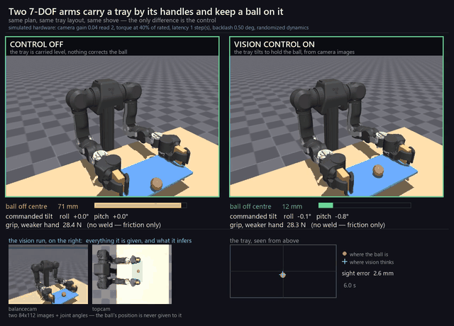

# Two arms, one tray, one ball

Two 7-DOF [OpenArm v2](https://github.com/enactic/openarm_mujoco) arms grasp a tray
by its handle posts and carry it while keeping a loose ball from rolling off —
in MuJoCo, with collisions on, nothing welded, and **both halves of the task
driven by camera images**: where the handles are, and where the ball is.



Left: the controller is off and the tray is carried level. Right: the same plan,
the same tray layout, the same shove — the balancer is running. The numbers on
screen are live, and the two small images at the bottom are everything the
policy on the right is given.

🕹 **[Run it in your browser](https://ahmedsleem109.github.io/openarm-tray-carry/web/)** — real MuJoCo physics in the tab, shove the ball yourself ·
▶ **[Full 12-second comparison](results/tray_demo.mp4)** ·
📄 **[What was measured, and what broke first](STATUS.md)** ·
🗺 **[Where this is going](PLAN.md)**

---

## The five things this had to be, all at once

Most tabletop manipulation demos drop at least one of these. Each is checked by a
test, not by assertion:

| | |
|---|---|
| **Vision, not privileged state** | The handle posts and the ball are both located from two 84×112 camera images. The simulator's own state is read only to *score* the estimate. |
| **A control algorithm applied** | A PD balance law does the control. The network estimates state and hands it over. Regressing the tilt end-to-end was tried, measured, and is worse — see below. |
| **Sim-to-real plausibility** | Torque-level actuation with explicit motor limits, command latency, transmission backlash, camera noise, randomized dynamics. All measured, all reported. |
| **Collisions enabled** | 43 collidable geoms, arm collision geometry included. Never disabled to make anything faster. |
| **Grasped, not welded** | Friction and form closure on box handle posts, ~42 N per hand. There is no weld anywhere in the scene. |

## Results

All simulation numbers, 12 unseen randomized carries each, **randomized tray
layouts**, identical plans and seeds across every row.

### The vision policy holds under the sim-to-real model

`vision` sees two 84×112 images and joint angles. `classical` reads the ball's
true state out of the simulator — it is the ceiling, not a competitor.

| condition | classical | vision | ball offset (vision) | sight error | grip |
|---|---|---|---|---|---|
| clean | 12/12 | **12/12** | 3.3 cm | 4.7 mm | 33.8 N |
| camera noise | 12/12 | **12/12** | 3.3 cm | 5.7 mm | 33.5 N |
| torque control, 40 % of rated motor torque | 12/12 | **12/12** | 3.3 cm | 4.6 mm | 34.3 N |
| 40 ms command latency | 12/12 | **12/12** | 3.9 cm | 5.1 mm | 33.5 N |
| 0.5° transmission backlash | 12/12 | **12/12** | 3.8 cm | 4.6 mm | 29.2 N |
| 1.5° backlash | 11/12 | **11/12** | 5.4 cm | 5.9 mm | 18.0 N |
| randomized dynamics | 12/12 | **12/12** | 3.4 cm | 4.6 mm | 33.8 N |
| **all of the above at once** | 12/12 | **12/12** | 4.2 cm | 6.0 mm | 29.5 N |

For scale, the floor: with the tray carried level and no balancing at all, the
ball survives **1 of 12**.

### The grasp is visual too

The usual shortcut is to read the object's pose out of the simulator and call the
result "vision". This does not.

| grasp | clean grasps | held through the carry | tray shoved | grip | handle estimate error |
|---|---|---|---|---|---|
| privileged (reads the simulator) | 12/12 | 12/12 | 5.9 mm | 43.0 N | — |
| **vision (two camera images)** | **12/12** | **12/12** | **5.6 mm** | 43.1 N | **0.7 mm** |

The privileged path is kept behind a flag, so the two are directly comparable on
the same layouts.

### How big the models are

0.16 M parameters for the ball estimator, 0.08 M for the handle detector. Both
train in minutes on one RTX 3060. Small models are not the achievement — they
are what falls out of estimating state and letting a PD law do the control.

## The part worth reading

[STATUS.md](STATUS.md) is the real document. It carries the measurements, and
also:

- **Eight bugs found by explicit audit**, including one that labelled every
  training frame with the ball's position 20 ms *in the future* and invalidated
  every dataset recorded before it, and one where a plan's yaw goal was absolute
  while its positions were relative — invisible until the tray started somewhere
  new.
- **A conclusion I got wrong and corrected in public.** Vision first scored 8/12
  under 1.5° of backlash against the classical controller's 11/12, and I read it
  as mechanical and perceptual failure compounding. It was neither: it was a
  detector that had only ever seen one tray position. Retrained over randomized
  layouts, vision matches classical exactly. Backlash is a mechanical limit.
- **A list of things that measured worse and are not being retried** — welding
  the tray to make GPU physics fast, regressing the tilt end-to-end (predictions
  come out at half the label magnitude, and half the loop gain is a different
  controller), regressing the ball's velocity (not observable — the ball moves a
  tenth of a pixel between stacked frames), acceleration feedforward, reaching
  further in to recover finger contacts.

The single most useful thing in it: **in estimator mode the network is a
detector, so it must be trained on the state distribution you want it accurate
over — which is uniform, not whatever a stabilising controller visits.**
Behaviour cloning on a good balancer's own rollouts scored 0/12 while being
accurate to 4.6 mm on the expert's own states.

## In the browser

`web/` runs the whole thing client-side: MuJoCo 3.13 compiled to WebAssembly,
the arm's meshes drawn straight out of the model, and the bimanual controller
ported to JavaScript — the same constants, the same approach sequence, the same
PD law. Measured at about **2.7k physics steps/s in Chromium, 2.7× realtime**,
with the grasp animated rather than skipped.

It runs the **classical** controller, not the vision policy, and says so on the
page. The policy is trained on MuJoCo's renderer and the page draws with
three.js; feeding it browser pixels would be a different visual distribution, so
it would fail — and it would look like the policy failing rather than the setup
being wrong.

```sh
cd web && npm install
npm run serve          # then open http://localhost:8000/web/
npm test               # the port reproduces the Python grasp and balance
npm run test:page      # loads the page in Chromium and checks it reaches "carrying"
```

## Running it

```sh
git clone --recurse-submodules https://github.com/ahmedsleem109/openarm-tray-carry
cd openarm-tray-carry
pip install -e third_party/openarm_mujoco   # the arm: meshes, pedestal, limits
pip install -e ".[learn]"                   # this project

# the classical controller, no checkpoint needed, writes an MP4
python scripts/render_tray.py --randomize-layout --out results/carry.mp4

# the comparison video, both controllers side by side with the overlays
python scripts/render_demo.py --out results/demo.mp4

# the sim-to-real table
python scripts/evaluate_tray_realism.py --episodes 12 --randomize-layout
```

`mujoco >= 3.13` is required and enforced: the contact solver changed between
3.12 and 3.13, and a scripted expert that scores 6/6 on 3.13 scores 1/6 on 3.12
from identical code.

## Layout

```
openarm_gym/
  control/bimanual_tray.py   the coordinated carry: one tray pose in, both arms out
  control/tray_task.py       carry plans and the single rollout driver everything shares
  control/tray_eval.py       named sim-to-real conditions and the evaluation loop
  policies/tray_vision.py    the ball estimator: two cameras, two stacked frames
  policies/handle_vision.py  the handle detector: one frame, used once per episode
  realism.py                 torque servo, latency, backlash, dynamics randomization
scenes/tray_grasp_scene.xml  the tray, its handle posts and the ball
scripts/                     record, train, evaluate, render
tests/                       125 tests, including one per bug listed in STATUS.md
```

One rollout driver, `run_plan`, is shared by data collection, evaluation and
video on purpose: a separate loop per purpose is how an evaluation quietly stops
measuring the task the data came from.

## What this is not

- **There is no real arm.** Every number here is a simulation number and is
  labelled as one. The sim-to-real layer is a model of hardware, not hardware.
- **The cameras are fixed to the world**, so the handle detector predicts world
  coordinates and extrinsic calibration is assumed away. On hardware that is a
  real step and it is where this piece's transfer gap lives.
- **The rendering is MuJoCo's.** No photorealism, no domain-randomized textures
  beyond the sensor model.

## Credit

The OpenArm v2 robot model is [Enactic's](https://github.com/enactic/openarm_mujoco),
vendored unmodified as a submodule under `third_party/`. The tray scene is
derived from their `balance_scene.xml`. Apache-2.0 throughout; see
[NOTICE](NOTICE).
